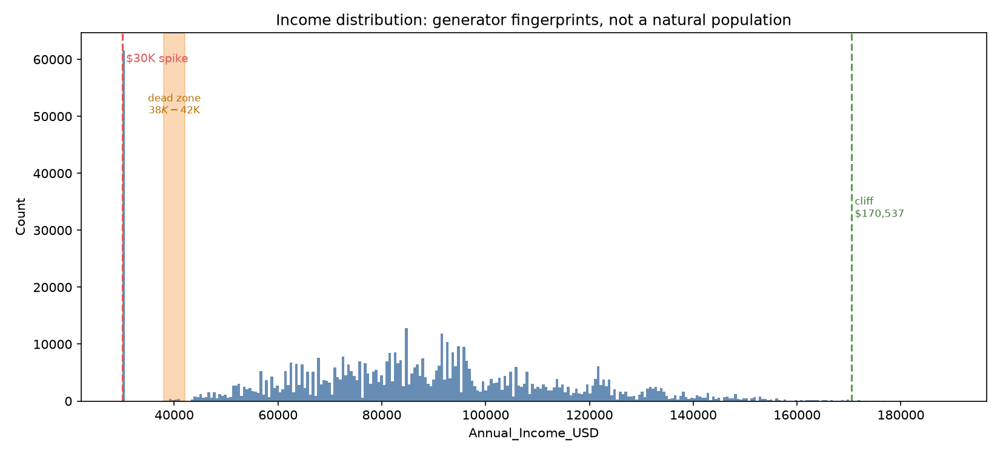
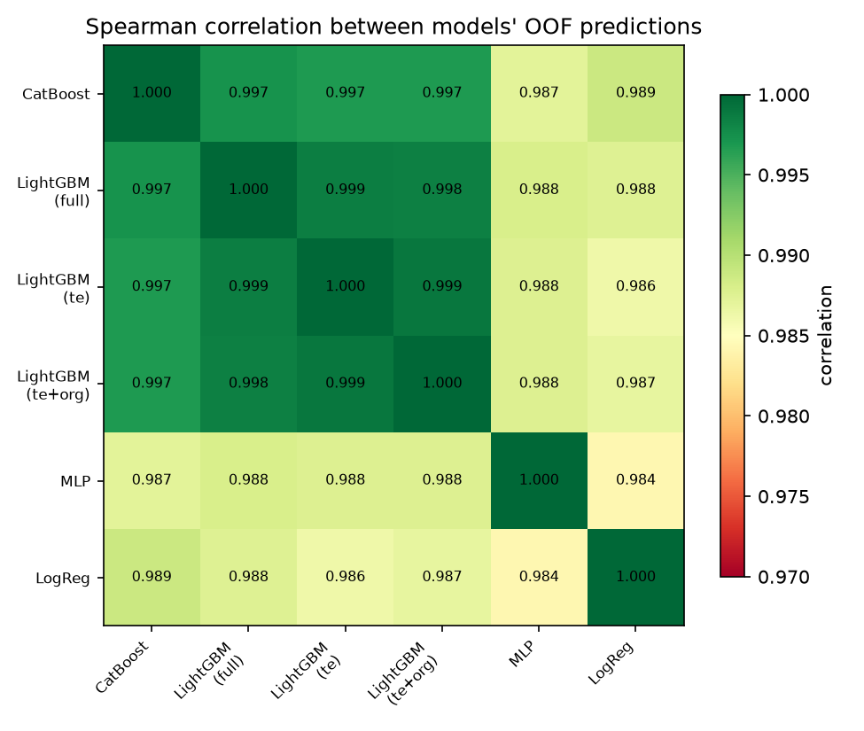
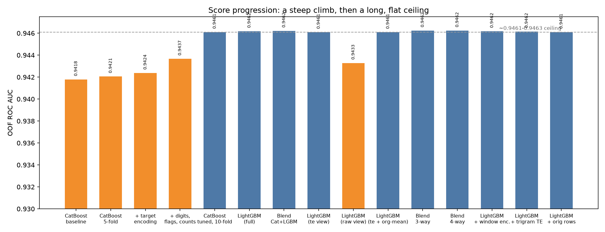

# Predicting EV Purchases — Kaggle Playground Series S6E9

## 🚗 Introduction

This repository trains binary classifiers to predict whether a person will buy an electric vehicle (`Will_Buy_EV`) for [Kaggle's Playground Series
Season 6, Episode 9](https://www.kaggle.com/competitions/playground-series-s6e9).
The competition is scored by ROC AUC - how well the model ranks buyers
above non-buyers, regardless of the exact probabilities it outputs.

Best result: a single **LightGBM model**, 10-fold cross-validated, scoring
**0.94628** on the public leaderboard (OOF 0.94616). Full results table at
the bottom.

## 📊 The data

Training data: 668,665 rows. Test data: 286,571 rows.
No missing values in either file. Each row is one person, described by 14
columns:

| Column | Type | Values / range | Meaning |
|---|---|---|---|
| `id` | int64 | 0 – 668,664 | row identifier |
| `Age` | int64 | 25 – 69 | age in years |
| `Annual_Income_USD` | float64 | 30,000 – 188,549 | annual income |
| `Daily_Commute_km` | float64 | 5 – 98.7 | daily commute distance |
| `Number_of_Cars_Owned` | int64 | 1 – 4 | cars owned by the household |
| `Charging_Stations_Near_Home` | int64 | 0 – 14 | count |
| `Charging_Stations_Near_Work` | int64 | 0 – 19 | count |
| `Environmental_Concern_Level` | float64 | 1 – 5 | self-reported concern |
| `Gender` | string | Male, Female, Other | gender |
| `City_Type` | string | Urban, Suburban, Rural | city type |
| `Current_Car_Type` | string | Sedan, SUV, Hatchback, Truck | car type |
| `Home_Charging_Possible` | string | Yes, No | |
| `Subsidy_Available` | string | Yes, No | |
| `Range_Anxiety_Level` | string | Low, Medium, High | ordinal |
| `Will_Buy_EV` | string | Yes, No | target |

Target balance: 82.5% `No` / 17.5% `Yes`, moderately imbalanced, that's why
ROC AUC is the right metric here.

A second, much smaller dataset is used later in the project: a real,
independently published 10,000-row survey of the same population that the
competition's synthetic data was generated to resemble (see
[Real-World Data Checks](#314-real-world-data-checks)).
It has the same columns, with c.2% of `Annual_Income_USD` and
`Daily_Commute_km` values missing by design.

## 🧹 Step 0. Preprocessing

Before any model sees the data, `prepare()` converts the following string columns into integers:

| Column | Original values | New values |
|---|---|---|
| `Home_Charging_Possible` | `"Yes"/"No"` | `1/0` |
| `Subsidy_Available` | `"Yes"/"No"` | `1/0` |
| `Range_Anxiety_Level` | `"Low"/"Medium"/"High"` | `0/1/2` |
| `Will_Buy_EV` | `"Yes"/"No"` |`1/0`|

`Gender`, `City_Type`, and `Current_Car_Type` are **not** integer-mapped.
They have no natural order, so forcing them into arbitrary integers would hand the
tree a fake ordering it might split on by accident. These three stay as
categories and go through target encoding instead (see
[Target Encoding](#36-target-encoding)).

Two ratio features are also computed at this stage: `Income_x_Concern`
(income × environmental concern) and `Income_Per_Car` (income / cars
owned). That are cheap interaction terms a tree would otherwise have to
approximate with several splits.

## 🔍 Step 1: Exploratory data analysis

The first pass ([explore.py](explore.py)) is a sanity check: column types, a missing-value count per column, `describe()` on the numeric columns, and the value counts of every categorical column and of the target.

Result: no missing values anywhere in `train.csv` or `test.csv`, no impossible category values, no outliers or data-quality problems to clean up.

## 🧠 Step 3: Algorithms

### 3.1 CatBoost

Gradient boosting on decision trees. Grows trees **symmetrically**: every
leaf at a given depth splits on the same rule, so every tree in the
ensemble has the same fixed structure. Uses ordered boosting internally to
reduce target leakage during its own training.

**Baseline configuration** — single 80/20 split, 15 raw features:

| Parameter | Value |
|---|---|
| `iterations` | 6000 |
| `learning_rate` | 0.03 |
| `depth` | 4 |
| `early_stopping_rounds` | 100 |

Result: local validation AUC 0.94178, public LB 0.94158.

**Tuned configuration** — 10-fold CV, 58 features:

| Parameter | Value | Meaning |
|---|---|---|
| `iterations` | 20000 | ceiling on trees; early stopping cuts it short |
| `learning_rate` | 0.02 | size of each tree's correction |
| `depth` | 6 | max depth of every tree (was 4 in the baseline) |
| `rsm` | 0.3 | fraction of columns each tree is allowed to see |
| `l2_leaf_reg` | 2.0 | L2 penalty on leaf values |
| `border_count` | 254 | number of bins used to discretize continuous columns |
| `early_stopping_rounds` | 300 | stop once 300 trees in a row don't improve validation AUC |
| `random_seed` | 42 | |

Result: OOF 0.94609, public LB 0.94606.

Depth and `rsm` were retuned once the feature count grew from 15 to 58
(the baseline's `depth=4` under-fit the larger feature set); this single
change was the largest hyperparameter-driven gain measured in the project
(OOF +0.0024). Sweeping `rsm` further (0.2 / 0.3 / 0.5) after that moved
the score by ~0.00002, inside run-to-run noise.

### 3.2 LightGBM

Gradient boosting on decision trees. Grows trees **leaf-wise**: at each
step it adds a split to whichever leaf gives the largest reduction in
loss, regardless of depth, so trees can end up asymmetric.

**Configuration** — 10-fold CV, 58 features (the base configuration reused
for every LightGBM experiment below):

| Parameter | Value | Meaning |
|---|---|---|
| `n_estimators` | 20000 | ceiling on trees; early stopping cuts it short |
| `learning_rate` | 0.02 | |
| `max_depth` | 5 | |
| `num_leaves` | 32 | maximum leaves per tree |
| `min_child_samples` | 10 | minimum rows required for a leaf to exist |
| `subsample` | 0.8 | fraction of rows each tree trains on |
| `subsample_freq` | 1 | resample rows on every tree |
| `colsample_bytree` | 0.3 | fraction of columns each tree is allowed to see |
| `reg_alpha` | 0.071 | L1 penalty on leaf values |
| `reg_lambda` | 2.0 | L2 penalty on leaf values |
| `max_bin` | 1024 | number of bins used to discretize continuous columns |
| `early_stopping` | 300 rounds | |
| `random_state` | 42 | |

Result: OOF 0.94617, public LB 0.94624 — the strongest single model in the
project. An aggressive variant (`num_leaves=255`, `min_child_samples=5`,
more/smaller trees) scored *worse* (OOF 0.94565), confirming this
configuration, not a more aggressive one, is the better fit for this
feature set.

### 3.3 Multi-Layer Perceptron (MLP)

A small feedforward neural network — layers of weighted sums and
nonlinearities, trained by gradient descent — used as an algorithmically
different candidate for blending (continuous weight updates instead of
tree splits).

| Parameter | Value |
|---|---|
| features | 20 |
| folds | 10 |

Result: OOF 0.94443. Spearman correlation with LightGBM: 0.987 (lower than
the 0.997+ measured between the tree models), but 0.0017 weaker in AUC.
Measured optimal blend weight: 0.00 — a model needs to be both decorrelated
*and* similarly strong to help a blend; this one met only the first
condition.

### 3.4 Logistic Regression

A linear model: fits one weight per feature and passes their weighted sum
through a sigmoid to produce a probability. No trees, no splits — the
decision boundary is a single hyperplane in feature space. Run locally
(fast enough not to need Kaggle's compute) on the exact same 58-feature
`full` view as CatBoost/LightGBM, with the target-encoded columns scaled
(`StandardScaler`, fit per fold like the encoder).

| Parameter | Value |
|---|---|
| `max_iter` | 2000 |
| `random_state` | 42 |

Result: OOF 0.94412 — clearly below CatBoost/LightGBM (0.9461+), but far
above the standalone recovered generator formula in
[Real-World Data Checks](#314-real-world-data-checks) (AUC 0.938),
showing that the hand-engineered features (digits, target encoding,
artifact flags) already linearize most of the underlying relationship.
Spearman correlation with LightGBM: 0.9875 (similar to the MLP), but
0.002 weaker in AUC (a larger gap than the MLP's 0.0017) — same outcome as
the MLP: measured optimal blend weight ≈ 0.

### 3.5 K-Fold Cross-Validation

Splits the training rows into K equal parts. Trains K models, each holding
out one part as validation and training on the remaining K-1 parts.
Produces a score averaged over K different validation splits instead of
one, and an **out-of-fold (OOF)** prediction for every row — the
prediction from the one model that did not train on it. OOF predictions
from different models line up row-for-row and enable blend-weight search
without spending Kaggle submissions.

Used with K=5 for the first experiments, K=10 once the feature set was
finalized.

### 3.6 Target Encoding

Replaces a categorical value — or a numeric value turned into a category,
e.g. income rounded to the nearest thousand — with the average target
value observed for that category. A tree can only split a number on
thresholds (`income > 80000`); it cannot look up "people earning exactly
92-93k buy at 21% historically" the way a lookup table can — target
encoding builds that lookup table directly.

Leakage control: fit only on the current fold's training rows
(`sklearn.preprocessing.TargetEncoder(cv=5)`, which cross-fits internally),
then *applied* — never re-fit — to validation and test rows.

Columns encoded in the main pipeline: `Gender`, `City_Type`,
`Current_Car_Type`, plus five numeric-derived string keys: `income_exact`
(exact dollar value as a string), `income100` / `income1000` (income
floored to the nearest hundred/thousand), `commute10` (commute floored to
the nearest 10 km), `age_int`.

**Variant — triple-smoothing target encoding:** the same keys encoded
three times at once, at smoothing strengths `auto`, `10.0`, and `100.0`
(how strongly a category's own average is pulled toward the global
average), so the model can pick whichever strength suits each split.

Result: OOF 0.9461, matching the full 58-feature model using a third of
the columns (20 vs. 58).

### 3.7 Digit Decomposition

Splits every numeric column into its individual digits — units, tens,
hundreds, and digits after the decimal point — one new column per digit
position, per source column.

Rationale: the income and commute distributions show sharp, non-natural
boundaries (see Artifact Flags below), consistent with a generator working
from rounded or bucketed values; digit decomposition exposes that
structure directly.

Result: combined with artifact flags and frequency/count encoding, moved
OOF from 0.94237 to 0.94366.

### 3.8 Artifact Flags

Binary flags marking specific value ranges identified by plotting the full
income and environmental-concern distributions (not visible in
`describe()`'s summary statistics):



| Flag | Condition |
|---|---|
| `is_30k_spike` | `Annual_Income_USD == 30000` |
| `is_income_cliff` | `Annual_Income_USD >= 170537` |
| `is_dead_zone` | `38000 <= Annual_Income_USD <= 42000` |
| `is_env_hater` | `Environmental_Concern_Level == 1` |

These are sharp discontinuities in density that do not occur in a natural
population — consistent with a synthetic generator clipping or
special-casing values at fixed boundaries.

### 3.9 Frequency / Count Encoding

For each target-encoded column, adds two more columns: how often that
value occurs in the combined train+test pool, as a proportion (`_fe`) and
as a raw count (`_cnt`). Computed once from train+test without touching
the target, so it is safe to compute outside the fold loop (no leakage
risk).

### 3.10 Neighbourhood Window Encoding

Replaces fixed-bucket target encoding on a continuous column (income,
commute) with a smoothed local average: the mean target value of every row
whose value falls within a radius of the row's own value, instead of a
hard bucket boundary. Several radii computed at once — income: ±$50 /
±$500 / ±$5,000; commute: ±0.2 km / ±1.0 km — each cross-fitted the same
way as target encoding (an inner 5-fold split), with an additive Bayesian
prior of 10 pseudo-observations toward the fold mean to stabilize windows
with few neighbours.

Result: OOF 0.94617, identical to the base LightGBM model without it.
Public LB 0.94626.

### 3.11 Joint (Interaction) Target Encoding

Target-encodes a **combination** of columns as a single joint string key,
instead of encoding each column separately — e.g.
`f"{concern}_{subsidy}_{anxiety}"` as one category, rather than three.
Tested on `Environmental_Concern_Level`, `Subsidy_Available`, and
`Range_Anxiety_Level` (the three columns most responsible for the buying
decision): two pairwise keys plus the full three-way key.

Result: OOF 0.94616 (base LightGBM model + 3 joint keys) — no OOF
improvement over the base model. Public LB 0.94628.

### 3.12 Rank Blending (Ensembling)

Converts each model's predictions to their **rank** (position if sorted,
scaled to [0, 1]) before averaging, instead of averaging raw
probabilities — removes distortion from one model's scores running
systematically higher or lower than another's. Blend weights are found by
sweeping candidate weights against the OOF arrays, scored against the real
training labels, before any submission is spent.

| Blend | Weights | OOF AUC | Public LB |
|---|---|---|---|
| CatBoost + LightGBM | 30% / 70% | 0.94620 | 0.94621 |
| CatBoost + LightGBM + LightGBM(te) | 30% / 45% / 25% | 0.946225 | — |
| CatBoost + LightGBM + LightGBM(te) + LightGBM(te+org-mean) | 25% / 40% / 10% / 25% | 0.94623 | — |

The first blend's weight (30/70) was chosen from a wider sweep (0.5/0.5 and
0.35/0.65 were tried first, both inside noise of each other and of 30/70)
— the leftover CSVs for those earlier weights are in
`submissions/blend/`, kept for the record but not separate results.

The blends struggle for a visible reason: every model here, tree-based or
not, ranks people almost identically.



The tree models (CatBoost, the three LightGBM views) sit at 0.997-0.999
correlation with each other regardless of which columns they were trained
on. MLP and Logistic Regression pull that down only to ~0.984-0.989 — a
small decorrelation gain, and in both cases not enough to offset how much
weaker they are (see [3.3](#33-multi-layer-perceptron-mlp) and
[3.4](#34-logistic-regression)).

### 3.13 Feature Views

Trains the same LightGBM configuration on three different column sets, to
test whether changing the *input columns* (rather than the algorithm)
produces models different enough from each other to blend usefully.

| View | Columns | OOF AUC |
|---|---|---|
| `full` | all 58 engineered features | 0.94617 |
| `te` | 20: categoricals + triple-smoothing target encoding only, no digits/flags/counts | 0.94607–0.94610 |
| `raw` | 15: the 14 original columns + 2 ratio features, no engineering | 0.94328 |

Spearman correlation, `full` vs. `te`: 0.998 — despite having almost no
columns in common, more correlated than CatBoost and LightGBM were with
each other on identical columns.

### 3.14 Real-World Data Checks

Three ways of using the original, non-synthetic 10,000-row dataset (see
[The data](#the-data)):

| Method | What it does | Result |
|---|---|---|
| Per-category averages | Maps each column's real-world buy rate onto train/test as a feature | OOF 0.94608 vs. 0.94607 without it — no measurable effect |
| Row-level matching | Searches for exact/near-exact matches between the 955,236 competition rows and the 10,000 real rows | 0 exact matches; near-matches at chance level only |
| Row concatenation | Adds a 10-fold split of the real rows (≈9,000/fold) into each fold's *training* set only, never validation | OOF 0.94609 vs. 0.94617 without it — no improvement |
| Recovered generator formula | Recomputes a published reconstruction of the competition's buy-decision formula (`1.2×income/100k + 0.6×concern + 2×subsidy − 1×medium_anxiety − 3×high_anxiety`, threshold 5.5) directly on the synthetic columns, with no training at all | AUC 0.938 alone; blend weight ≈ 0 on top of LightGBM |

### 3.15 The Ceiling

Grouping rows by their four most predictive features finds a group of
~5,000 people, identical on those features, splitting 88.1% buy / 11.9%
do not — a spread not explained by anything observable in the data. Every
algorithm and feature combination tested in this project converges to OOF
≈ 0.9461–0.9463: each is estimating the same underlying rate, and the
remaining error at that point is largely irreducible.

## 📁 Repository structure

```
prepare.py              shared feature-preparation function, used by the local scripts below
explore.py              Step 1: EDA — column types, missing values, target balance
train.py                first model: a single 80/20 train/validation split
train_cv.py             upgrades train.py to 5-fold cross-validation
train_cv_te.py          adds target encoding on top of train_cv.py
train_logreg.py         logistic regression on the same 58-feature view as LightGBM
make_charts.py          generates the charts in assets/, used in this README
assets/                 charts embedded above
predict.py              loads a saved model and writes a submission file
blend.py                rank-blends two or more finished submission CSVs
find_blend_weights.py   sweeps blend weights against out-of-fold predictions
experiments.jsonl       one line per run: parameters, feature count, OOF score, public score
notebooks/catboost/     CatBoost scripts written to be pasted into a Kaggle notebook
notebooks/lgbm/         LightGBM scripts, same purpose
notebooks/mlp/          a neural-network baseline used to test blend diversity
```

`data/`, `oof/`, and `submissions/` are gitignored: `data/` holds the
competition's CSVs, `oof/` holds each model's out-of-fold and test-set
prediction arrays (needed to search blend weights without spending a
submission), and `submissions/` holds the CSVs actually uploaded to Kaggle.

The local scripts (`train.py` through `train_cv_te.py`) were the first
experiments, sized to run on a laptop without a GPU. Once the feature set
grew and 10-fold cross-validation became the standard, training moved to
Kaggle's own notebooks (which provide more CPU/RAM and both CatBoost and
LightGBM) — the `notebooks/` scripts are the versions pasted there. Local
work only needs `uv sync` and `uv run python <script>.py`; nothing here
requires a GPU.

## 🏆 Results

| Model | Features | OOF AUC | Public LB |
|---|---:|---:|---:|
| CatBoost, single 80/20 split, depth=4 | 15 | 0.94178 | 0.94158 |
| CatBoost, 5-fold CV, depth=4 | 15 | 0.94205 | 0.94192 |
| CatBoost, 5-fold CV + target encoding | 21 | 0.94237 | — |
| CatBoost, 5-fold CV + digit features + artifact flags + frequency/count encoding | 52 | 0.94366 | 0.94373 |
| CatBoost, 10-fold CV, tuned (depth=6, rsm=0.3) | 58 | 0.94609 | 0.94606 |
| **LightGBM, 10-fold CV, same 58 features** | 58 | **0.94617** | **0.94624** |
| Rank blend: 30% CatBoost + 70% LightGBM | 58 | 0.94620 | 0.94621 |
| LightGBM, "te" view: triple target encoding, no digits/flags | 20 | 0.94607–0.94610 | — |
| LightGBM, "raw" view: 14 original columns + 2 ratios | 15 | 0.94328 | — |
| LightGBM, "te" view + real-dataset category averages | 33 | 0.94608 | — |
| Rank blend: CatBoost + LightGBM + LightGBM(te) | — | 0.946225 | — |
| Rank blend: CatBoost + LightGBM + LightGBM(te) + LightGBM(te+org-mean) | — | 0.94623 | — |
| LightGBM, step 6 + income/commute neighbourhood-window encoding | 60 | 0.94617 | 0.94626 |
| **LightGBM, step 6 + joint target encoding of the three attitude columns** | 67 | 0.94616 | **0.94628** |
| LightGBM, step 6 + original dataset rows concatenated into training | 58 | 0.94609 | 0.94616 |



## ✅ Conclusions

The best public score in this project — **0.94628** — came from LightGBM
with joint target encoding of the three attitude columns, and it makes an
honest case against reading too much into the last few thousandths of a
point: that entry's OOF score (0.94616) is actually the *lowest* of the
three LightGBM variants compared in the results table, yet its public
score is the *highest*. The rank-blend of CatBoost and LightGBM shows the
same pattern in reverse — a slightly higher OOF than plain LightGBM, but a
slightly *lower* public score. OOF and the public leaderboard disagree on
the ranking of these near-identical models, which is exactly what "these
differences are inside measurement noise" looks like in practice, not a
caveat to explain away.

A few things stand out from the full run of experiments:

- **Reading the data mattered more than choosing a model.** The single
  biggest jump in the project (OOF 0.94237 → 0.94366) came from noticing
  the generator's own fingerprints — the $30K income spike, the dead zone,
  the digit-level rounding artifacts — not from switching algorithms.
- **CatBoost and LightGBM converged on almost the same answer.** Given the
  same 58 columns, the two libraries correlate at 0.997 — different growth
  strategies (symmetric vs. leaf-wise trees), same conclusions. Blending
  them gained +0.00003 OOF, essentially nothing.
- **Every attempt to find one more genuinely new source of signal came back
  empty**, and by a wide and varied margin of technique: alternate feature
  views, real-world per-category averages, exact row matching, real rows
  concatenated into training, neighbourhood window encoding, and joint
  interaction encoding. None of these moved OOF outside of noise, in
  either direction.
- **That ceiling is measurable, not assumed.** Rows identical on the four
  strongest features still split 88.1% / 11.9% on the actual outcome — a
  gap nothing in this project's data, features, or models can close,
  because it is noise built into how the labels were generated, not a
  pattern waiting to be found.

Taken together: this project reached the practical ceiling for this
feature set and these two model families. The remaining gap to the very
top of the public leaderboard is more likely explained by a fundamentally
different source of information (or by leaderboard-split luck) than by
another round of feature engineering on the same columns.

## 🏁 Postscript: what the winners did differently

The competition closed on September 30, 2026. Final standings are scored
on a private 80% holdout of the test set, separate from the public score
shown during the competition — and the private leaderboard reordered the
field, including at the very top.

### The public #1 did not hold

The team that led the public leaderboard for most of the competition
(0.94945, 0.0027 clear of 2nd place — an unusually large gap on this
leaderboard) finished **2nd on the private leaderboard at 0.94588**, behind
Chris Deotte's 0.94602. Their own solution writeup explains why: that
0.94945 file was a deliberate experiment in estimating the public test
set's labels from publicly shared, scored submission files, and tilting
predictions toward that estimate. The same file scored **0.94313 on the
private leaderboard** — worse than roughly 1,645 other teams. They
identified this themselves, excluded that file from their two official
final submissions, and placed 2nd with honestly validated models instead.

This matches, with real numbers, something this project could previously
only call a guess: the unexplained gap to the public #1 was not a
modeling insight. It was public-leaderboard overfitting, and it collapsed
exactly the way overfitting collapses once scored on unseen data.

### What separated the actual top finishers

Reading the 2nd and 3rd place solution writeups, the gap to this project's
ceiling (~0.9461-0.9463 OOF) is not one clever feature — every one of the
targeted ideas tested in [3.10](#310-neighbourhood-window-encoding), [3.11](#311-joint-interaction-target-encoding),
and [3.14](#314-real-world-data-checks) has an analogue in their writeups too,
and none of them was the deciding factor for them either. What they had
instead:

- **TabPFN** — a pretrained tabular foundation model used as the primary
  classifier, given the *entire* labelled training set (up to ~668,665
  rows) as in-context input rather than being fit with gradient descent on
  this dataset specifically. Their own ablation shows AUC still climbing
  with no sign of saturating as context size grew — a capability neither
  CatBoost nor LightGBM has an equivalent of, and one that needs tens of
  GB of GPU memory per fold.
- **LLM-derived features.** A small language model (`distilgpt2`)
  fine-tuned only on the 10,000 real rows produced a log-likelihood-ratio
  feature — how plausible a row's combination of values is as a "bought"
  story versus a "didn't buy" story — fed into TabPFN as one more column
  alongside the engineered ones.
- **Tokenizing numbers as text.** Motivated by a forum theory that the
  generator emits numbers as LLM tokens, both top teams extracted GPT-2
  byte-pair-encoding token features from the income and commute values'
  *string* representation — a different granularity of the same idea
  behind this project's digit decomposition.
- **A formal statistics discipline**: every candidate feature or model had
  to beat a minimum effect size *and* a minimum number of standard errors
  across folds, checked against a same-width random-permutation placebo
  run alongside it, with experiments logged before their results were
  known. This is the same judgment this project applied by hand throughout
  (±0.00002 being noise, a flat top-5 blend sweep being a non-result) ,
  formalized into a pre-registered protocol.
- **Ensembling at a different scale.** 3rd place's final submission was a
  logistic-regression stack over **115 prediction columns** from a dozen
  model families (XGBoost, LightGBM, RealMLP, TabM, transformer-based
  tabular models, and more) — logistic regression used as a *meta-model*
  over many diverse predictions, not as a standalone competitor to them
  (compare [3.4](#34-logistic-regression) in this project, where it was
  tested alone).

### Independent confirmation of this project's own null results

Both writeups independently ran into findings this project already
documented:

- **Concatenating the original dataset's rows into training did not
  help them either** — 3rd place's writeup states this explicitly, which
  matches [3.14](#314-real-world-data-checks)'s own result almost exactly
  (OOF 0.94609 vs. 0.94617 without it).
- **Multi-resolution target encoding of income was their single most
  effective classical feature-engineering lever** — the same conclusion
  this project reached in [3.6](#36-target-encoding) and [3.7](#37-digit-decomposition).
- **The public leaderboard is a weak, overfittable signal relative to
  proper cross-validation** — 2nd place measured their nested-CV gain
  correlating with private rank at Spearman 0.991, versus only 0.793 for
  the public score. This is the same pattern behind this project's own
  observation that OOF and public LB disagreed on the ranking of several
  near-identical models (see the chart above, and step 7's blend scoring
  lower publicly than a higher-OOF model).

### What it would take to close the gap

Not more feature engineering on these 58 columns — that door is reasonably
well-explored in this project and in theirs. The actual gap is
infrastructure and scale: GPU-hours and a licensed foundation-model
checkpoint (TabPFN), a fine-tuned LLM, and a 2-3 person team running and
stacking over a hundred models with a formal pre-registration process.
That is a different kind of project from a solo effort on a laptop without
a GPU — not a harder version of the same one.
